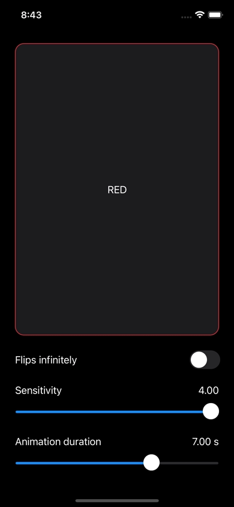
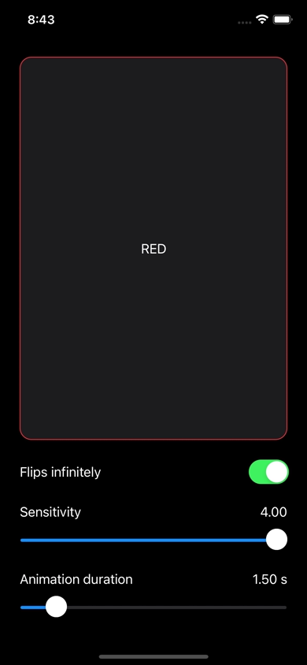

# FlipContainerView

 

It is a reusable element that imitates a flippable double-sided card.

The project is provided with `ExampleVC.swift` which lets you clone and run this repo to check out the capabilities of it with a few customization options.

Built using XCode 13.1 (Swift 5.5, for iOS 13.0 or later).

### TODO:
- [ ] Include a property to toggle on/off the shadow;
- [ ] Include more customization options for UISpringTimingParameters of the flip animation;
- [ ] Include unit and UI tests;

### How to run:

1. Clone this repo;
1. Open `FlipContainerView.xcodeproj`;
1. Build and run the project on a selected device (or a simulator).

## License

FlipContainerView is licensed under the terms of the MIT license.
